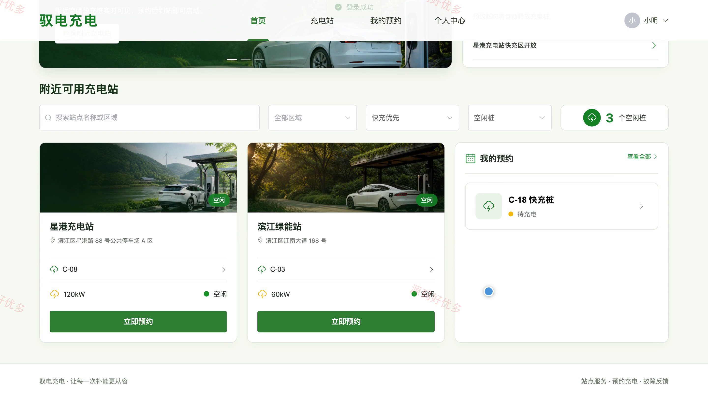
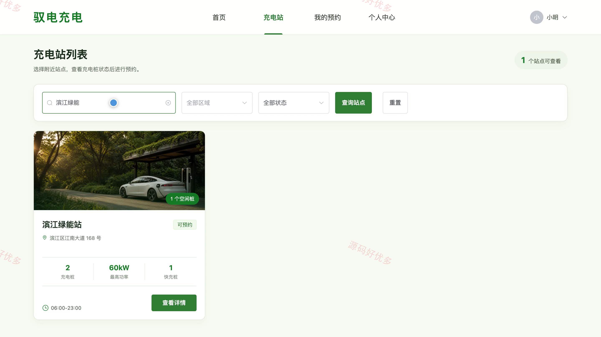
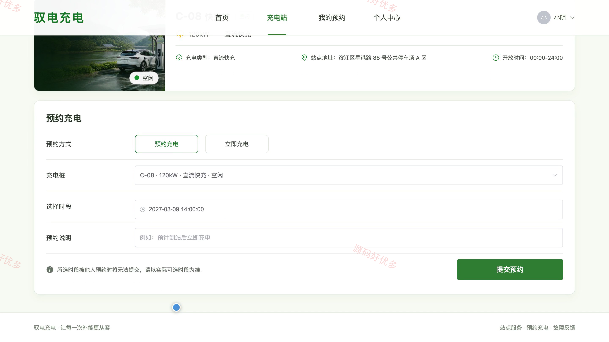
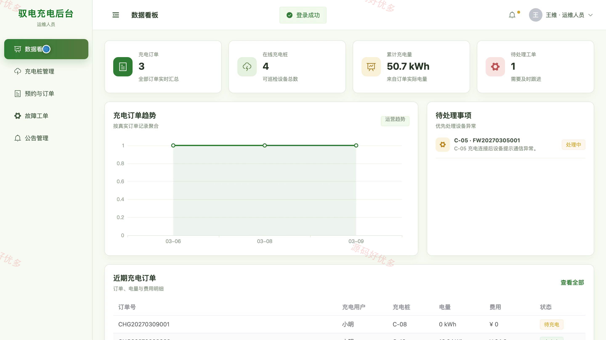
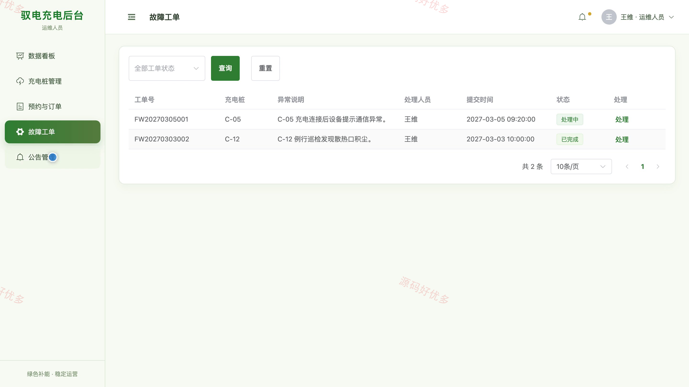
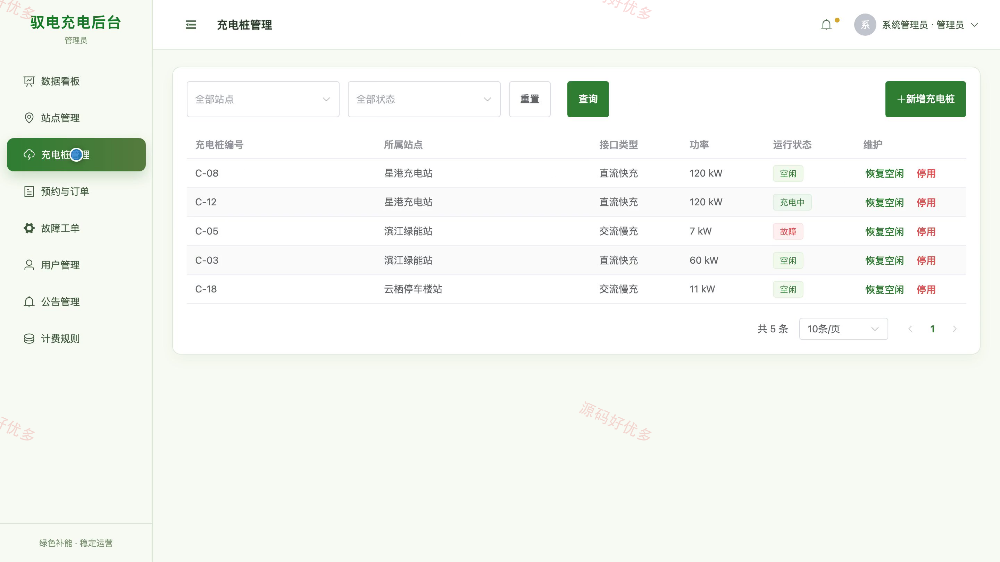
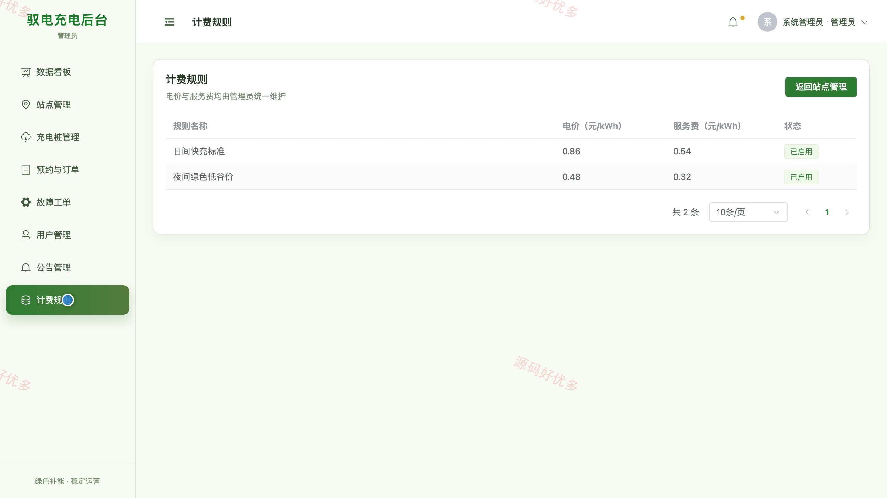

# bs032A
bs032A充电桩管理系统
## 源码问题查看主页咨询

### 一、关键词
充电桩、汽车充电、充电站、充电预约、设备运维

### 二、作品包含
源码+数据库+全套环境和工具资源+本地部署教程

### 三、项目技术
前端技术： Html、Css、Js、Vue3.4、Element-Plus
后端技术：Java、SpringBoot3.2.0、MyBatis-Plus

### 四、运行环境（以下版本亲测，其他版本兼容性请自行测试）
开发工具：IDEA/eclipse + VSCODE

数据库：MySQL5.7+（共10张表）

数据库管理工具：Navicat10以上版本

环境配置软件： JDK17 + Maven3.6.3

前端Nodejs：16+

浏览器：谷歌浏览器

### 五、项目介绍
项目编号：bs032A

系统面向充电用户、运维人员和管理员，围绕充电站与充电桩查询、到站预约、充电记录、设备故障闭环和运营管理构建完整业务流程。充电用户可筛选站点与空闲充电桩、提交预约、启动充电并查看记录；运维人员负责预约核验、设备巡检和故障工单处理；管理员统一维护站点、充电桩、计费规则、用户、公告及运营统计。

角色：充电用户、运维人员、管理员

充电用户功能：账号注册与登录、充电站筛选与详情查看、充电桩状态与功率查看、充电时段预约、启动充电、预约与充电记录查看、设备故障反馈、个人资料维护。

运维人员功能：运维数据看板、充电桩巡检与状态维护、预约核验、充电订单处理、故障工单处理、公告查看、个人资料维护。

管理员功能：运营数据看板、用户与运维账号管理、充电站管理、充电桩管理、计费规则管理、预约与订单管理、故障工单管理、公告管理。

### 六、运行截图

